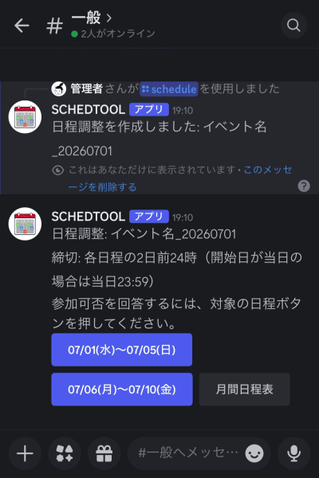

# Schedule Tool

Discord用の日程調整Botです。

[使い方はこちら](https://tory12x2.github.io/SchedTool/)

イベントごとに日程候補を作成し、メンバーが `◎ / △ / ×` ボタンで回答できます。
回答結果の集計、月間日程表、締切、自動作成、開催日通知に対応しています。



## セットアップ

### 1. Discord Botを作成する

Discord Developer PortalでBotを作成し、Bot Tokenを取得します。

Bot設定では、次を有効にしてください。

- `SERVER MEMBERS INTENT`
- `MESSAGE CONTENT INTENT` は不要です

Botをサーバーへ招待するときは、OAuth2 URL Generatorで少なくとも次のスコープと権限を付けます。

- Scope: `bot`
- Scope: `applications.commands`
- Permission: メッセージ送信
- Permission: メッセージ履歴を読む
- Permission: 埋め込みリンク

通知先にするチャンネルでは、Botがチャンネルを閲覧し、メッセージ送信と埋め込みリンク送信をできるようにしてください。

### 2. リポジトリをcloneする

```bash
git clone https://github.com/Tory12x2/SchedTool.git
cd SchedTool
```

### 3. Python環境を作る

```bash
python3 -m venv venv
source venv/bin/activate
pip install -r requirements.txt
```

### 4. 環境変数を設定する

```bash
cp .env.example .env
```

`.env` を開いて、通常は `DISCORD_TOKEN` だけを設定すれば使い始められます。

```text
DISCORD_TOKEN=your_discord_bot_token_here
```

必要に応じて、初期通知先チャンネルも設定できます。ただし、Discord上で `/setup` または `/notification_channel_setting` から設定する方が分かりやすいです。

```text
RESULT_CHANNEL_ID=123456789012345678
```

未設定の場合は、最初に日程調整を作成したチャンネルが通知先として自動保存されます。
通知先を分けたい場合は、Bot起動後にDiscordで `/notification_channel_setting` を実行してください。

### 5. 起動する

```bash
python main.py
```

起動に成功すると、Botが参加しているDiscordサーバーにスラッシュコマンドを同期します。

## 管理者向けの初期設定

最初に管理者が `/setup` を実行するのがおすすめです。
通知チャンネルと参加予定者ロールは選択メニューで、イベント名と日数は入力フォームで設定できます。

Discordサーバー内に、日程調整用チャンネルと通知用チャンネルを分けて作っておくと運用しやすくなります。
日程調整用チャンネルでは `/schedule` や `/auto_schedule_start` を実行し、通知用チャンネルは `/notification_channel_setting` で設定します。
通知用チャンネルを未設定のまま使い始めた場合は、最初に日程調整を作成したチャンネルが通知先になります。

必要に応じて、日程調整の対象メンバー用ロールも作成し、`/participant_role_setting` で設定してください。
対象が24人を超える場合は、通知と月間日程表を見やすく保つため参加予定者ロールの設定を推奨します。

## よく使う流れ

### 日程調整を作成する

初回は `/setup` でイベント名と日数を設定します。
コマンドで直接設定する場合は、次を実行します。

```text
/schedule_setting event_name:定例会 days:10
```

その後、開始日を指定して日程調整を作成します。

```text
/schedule start:2026-07-01
```

イベントIDは `定例会_20260701` のように自動で作られます。
回答UIはDiscordの制限に合わせて5日ずつに分かれ、公開メッセージには
`07/01(水)〜07/05(日)` のような日程範囲ボタンが表示されます。

### 回答する

日程範囲ボタンを押すと、押した人だけに回答画面が表示されます。
各日付に対して `◎ / △ / ×` を選びます。
参加予定者ロールが設定されている場合は、そのロールのメンバーと管理者だけが回答できます。

公開メッセージには `月間日程表` ボタンも表示されます。
このボタンを押すと、押した人だけに全員の入力内容が日付ごとに表示されます。
対象が24人を超える場合は「前へ」「次へ」でページを切り替えられます。

自分のアイコンを指定したい場合は、次を実行します。

```text
/my_icon icon:🍎
```

他のメンバーが使っているアイコンは指定できません。

## 締切

日程調整を作成すると、日付範囲ごとに締切が自動保存されます。
締切は、各日程の2日前の終日までです。実際には締切日の翌日0時以降に回答ボタンが無効化されます。

開始日が当日の範囲は例外として、当日 `23:59` まで回答できます。
締切を過ぎると、Botが自動で対象の日付範囲ボタンを無効化します。

手動で終了したい場合は、管理者が次を実行します。

```text
/close event_id:定例会_20260701
```

## 日程調整の自動作成

自動作成を開始するには、日程調整を出したいチャンネルで実行します。
指定したイベント名の最新の日程調整を基準にして、次回分から自動作成します。

そのため、自動化したいイベント名で、初回だけは `/schedule_setting` と `/schedule` で手動作成しておきます。
同じイベント名の過去の日程調整が1件もない場合は、次回開始日と日数を判断できないため自動作成を開始できません。

```text
/auto_schedule_start event_name:定例会 lead_days:5
```

- `event_name`: 自動作成するイベント名です
- `lead_days`: 開始日の何日前に日程調整を出すかです。省略時は5日前です
- 1回の日数は、指定したイベント名で作成済みの最新の日程調整から引き継ぎます
- 次回開始日は、最新の日程調整の最終日の翌日になります
- 次回以降は、同じ日数ごとに自動で次の期間へ進みます

自動作成を止めるには、次を実行します。

```text
/auto_schedule_stop event_name:定例会
```

## 開催日通知

開催日通知は、デフォルトで1日前の21時に通知されます。
参加予定者ロールを設定すると、そのロールのメンバーだけを対象に管理します。
未設定の場合は、Bot以外のサーバーメンバー全員を対象にします。

```text
/participant_role_setting role:@参加予定者
```

ロールを設定すると、開催日通知では個人ではなく参加予定者ロールをメンションします。
通知を受け取れるよう、Discord側でそのロールをメンション可能にしてください。
ロールを解除して全メンバー対象に戻す場合は `/participant_role_clear` を実行します。
設定中のロールが削除された場合は、自動作成と通知を停止して管理者へ再設定を案内します。

イベント作成後にサーバーへ参加した人や対象ロールへ追加された人は、現在の回答対象に加わります。
Botは毎日、通知設定時刻に増加を確認し、回答募集中のイベントがあれば追加メンバーへ1回案内します。

通知されるのは、対象者全員が予定を入力済みで、かつ `×` が1人もいない場合だけです。
`△` は参加確率50%として扱い、保留人数に応じた開催確率を通知に表示します。

通知先を変えたい場合は、管理者が通知先にしたいチャンネルを指定して実行します。

```text
/notification_channel_setting channel:#通知先チャンネル
```

通知で参加可能者と保留者にメンションするかどうかも設定できます。

```text
/notification_mention_setting enabled:true
/notification_mention_setting enabled:false
```

通知タイミングを変えたい場合は、管理者が次を実行します。

```text
/reminder_setting days_before:1 hour:21 comment:忘れずに準備お願いします
```

通知の見た目を確認したい場合は、管理者がイベントIDと日付を指定してテスト送信できます。

```text
/available_day_reminder_test event_id:定例会_20260701 date:2026-07-01
```

通知文は次の形式です。

```text
@参加予定者

開催日のお知らせ
イベント: 定例会_20260701
日程: 07/01(水)
参加可能: 18人
保留: 3人
開催確率: 25%…保留の方は確定次第コメントください
```

## 主なコマンド

- `/setup`: 初期設定を案内します
- `/schedule_setting`: イベント名と日数を設定します
- `/schedule`: 日程調整を作成します
- `/participant_role_setting`: 参加予定者ロールを設定します
- `/participant_role_clear`: 参加予定者ロールを解除します
- `/list`: イベント一覧を実行者だけに表示します
- `/announce`: 結果を通知チャンネルへ投稿します
- `/close`: イベントを締め切ります
- `/delete`: イベントを削除します
- `/admin_status`: Bot設定と未回答者を確認します
- `/my_icon`: 月間日程表で使う自分のアイコンを設定します

## 設定

`.env` で設定できます。

```text
DISCORD_TOKEN=your_discord_bot_token_here
RESULT_CHANNEL_ID=
GUILD_ID=
DATABASE_PATH=schedule.db
SCHEDTOOL_LOG_DIR=logs
SCHEDTOOL_LOG_RETENTION_DAYS=30
```

- `DISCORD_TOKEN`: 必須。Discord Bot Tokenです
- `RESULT_CHANNEL_ID`: 任意。初期通知先チャンネルIDです。通常は空のままにして、Discord上で設定します
- `GUILD_ID`: 任意。古いローカルデータの移行用です。通常は空で構いません
- `DATABASE_PATH`: 任意。SQLite DBの保存先です
- `SCHEDTOOL_LOG_DIR`: 任意。運用ログの保存先です。Docker運用では未指定なら `/data/logs` に保存されます
- `SCHEDTOOL_LOG_RETENTION_DAYS`: 任意。運用ログを何日分残すかを指定します。初期値は30日です

## 運用ログ

SchedToolは、負荷やエラー状況を確認できるように運用ログを保存します。

記録する主な内容:

- 起動、参加サーバー数、キャッシュ済みメンバー数
- 日次のイベント数、回答数、DBサイズ
- 自動作成、締切、開催日通知、追加メンバー通知の処理件数
- コマンド設定変更、回答保存、権限エラー、Discord APIエラー

Botトークン、環境変数、メッセージ本文、DM内容はログに出しません。ログ保存先はWeb公開ディレクトリに置かないでください。

## ファイルの役割

- `main.py`: Botを起動します
- `config.py`: 環境変数、ボタン表示名、最大日数などを設定します
- `commands.py`: スラッシュコマンドを定義します
- `views.py`: 日付ごとの `◎ / △ / ×` ボタンUIを定義します
- `embeds.py`: 結果表示の文章や見た目を定義します
- `database.py`: SQLiteへの保存、取得、削除処理をまとめています
- `schedule_service.py`: 日程調整の作成処理です
- `close_service.py`: 締切処理です
- `auto_scheduler.py`: 自動作成、締切、開催日通知の定期処理です
- `operational_logging.py`: 運用ログの保存と日次ヘルスログを担当します
